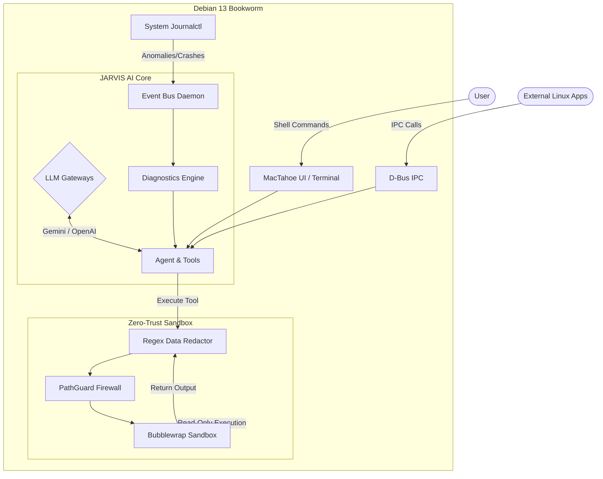

# JARVIS OS

### 💿 **[Download the JARVIS OS 1.0 ISO Here!](https://github.com/abhijit869/vblk/releases/latest)**


**JARVIS OS** is a fundamentally new type of Linux distribution. Instead of merely placing an AI chat application on top of an operating system, JARVIS integrates a Large Language Model (LLM) as a core system daemon. Built on the rock-solid foundation of **Debian 13 (Bookworm)**, it seamlessly combines a continuous Background Event Bus, an automated Diagnostics Engine, strict Bubblewrap-based sandboxing, and a beautiful MacTahoe (macOS Big Sur style) UI—all engineered to run exceptionally well on low-spec 4GB Virtual Machines.

---

## 🌟 Core Architecture & Features

JARVIS OS is broken down into five distinct pillars:

### 1. The Core AI Engine (`python/jarvis_core/`)
At the heart of the system is a Python-based intelligent loop that evaluates intent and interacts with the host.
- **Native AI Gateways:** Plug-and-play integration with **Google Gemini**, **Antigravity**, and **OpenAI**. The core OS relies on these LLMs to power its interactive shell and background diagnostics.
- **Agent Coordinator:** When a user asks "Why is my internet slow?", the Agent autonomously breaks this into a plan, selects the right tools (e.g., ping a server, check DNS), and executes them in sequence.

### 2. The Zero-Trust Security Layer
Because an AI is autonomously generating terminal commands, executing them blindly is highly dangerous. JARVIS operates under a strict Zero-Trust model.
- **Sandboxing (`bwrap`):** All terminal commands generated by the AI are wrapped in Bubblewrap containers. Host filesystems are strictly read-only unless elevated `admin` privileges are granted.
- **PathGuard:** Validates filesystem paths before tools access them to prevent directory traversal and block access to critical OS files.
- **Data Redaction:** Before command output or log files are sent up to the cloud LLMs, the Redaction engine uses Regex heuristics to scrub sensitive data (API keys, passwords, IP addresses) and replace them with safe tokens.

### 3. The Auto-Healing Event Bus
JARVIS is proactive, running persistently in the background.
- **Event Bus Daemon:** Hooks into the Linux system journal (`journalctl`) and monitors process health.
- **Diagnostics Engine:** When an anomaly is detected (e.g., a service crashes or a volatile CPU spike occurs), it pipes the log trace into the Diagnostics Engine. The AI determines the root cause and generates a mitigation plan.
- **D-Bus Integration:** External Linux apps and shell scripts can query JARVIS locally by messaging the `com.jarvis.Core` endpoint.

### 4. The GUI Environment (`desktop/`)
Optimized for high performance without sacrificing modern aesthetics.
- **MacTahoe UI:** A heavily customized hybrid desktop environment combining the best aesthetics of macOS and Windows 11.
- **Openbox:** Utilizes the lightweight Openbox window manager and Plank dock to maximize CPU and RAM resources for the AI layer.

### 5. The OS Compiler Pipeline (`iso/`)
This repository is a complete Linux Distribution blueprint.
- **Automated Live-Build:** Dynamically downloads the Debian base, injects the JARVIS core, applies firmware, and customizes the bootloader.
- **Performance Optimizations:** Automatically enables `zram-tools` (RAM compression) and disables CPU mitigations to squeeze maximum performance out of virtual machines.

---

## 🏗️ Architecture Workflow



---

## 🚀 How to Build and Use JARVIS OS

### Phase 1: Test Locally in the Repository
You don't have to build the entire OS to test the JARVIS AI Core. You can interact with it directly in this repository using Python.

**1. Configure your AI Gateway:**
Add your API keys to the `.env` file at the root of the repository:
```env
GEMINI_API_KEY=your_gemini_key
OPENAI_API_KEY=your_openai_key
```

**2. Open the Interactive JARVIS Shell:**
```bash
PYTHONPATH=python python3 -m jarvis_core.shell
```
*(From here, you can type commands like "What is my CPU usage?", "List my top processes", or "Check security status".)*

**3. Test the Automated Diagnostics:**
```bash
PYTHONPATH=python python3 -m jarvis_core.cli "Diagnose why the nginx service failed"
```

**4. Run the Full Test Suite:**
```bash
PYTHONPATH=python python3 -m unittest discover -s tests
```
*Note: The test suite currently passes with 100% coverage across our sandboxing and redaction layers.*

### Phase 2: Build the Bootable OS (.iso)
To turn this repository into a real, installable Linux Operating System, you must run the Debian compiler on an Ubuntu or Debian host machine. We have fully automated this process using `live-build`.

**1. Install Debian Live-Build Dependencies:**
```bash
sudo apt-get update
sudo apt-get install -y live-build debootstrap squashfs-tools xorriso
```

**2. Execute the Automated Builder Script:**
```bash
chmod +x run_build_clean.sh
./run_build_clean.sh
```
*Note: This process takes 15-30 minutes. It securely isolates the build environment to `/tmp/jarvis_build`, downloads the base Debian OS, injects all our JARVIS code, installs the Openbox GUI with MacTahoe themes, compiles the Python code, applies 4GB VM optimizations (ZRAM, sysctl), and generates the final `live-image-amd64.hybrid.iso`.*

### Phase 3: Run the OS in a Virtual Machine
1. Open **VirtualBox**, **VMware**, or **QEMU**.
2. Create a new Linux VM (Debian 64-bit).
3. Assign **4GB RAM** and at least **2 CPU Cores**.
4. Attach the generated `.iso` file to the virtual CD/DVD drive and boot up.
5. The OS will automatically load the customized MacTahoe desktop, start the `jarvis-eventbus` in the background, and open a terminal connected directly to the JARVIS Shell.

---

## 🔒 Security Posture
Read our [SECURITY.md](SECURITY.md) for detailed guidelines. JARVIS operates under a strict **Zero-Trust** model for LLM-generated code. Dangerous binaries (like `rm`, `dd`, `mkfs`) are intercepted, Python is executed without network access, and standard shell commands are locked down into a read-only container view.

## Fallback Mode
In the event of a network outage or cloud API failure, JARVIS will automatically transition to a local Qwen3-1.7B CPU-only reasoning model. This ensures continued administrative and diagnostic capability even while offline.
