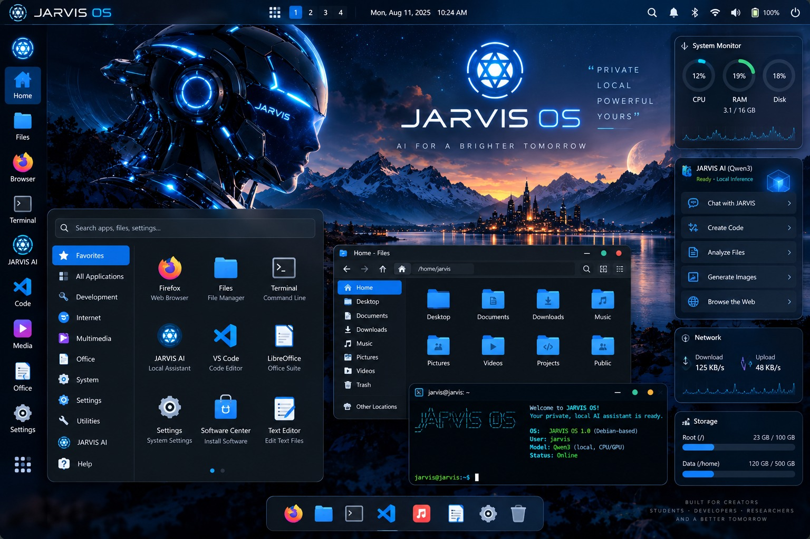

# JARVIS OS

### 💿 **[Download the JARVIS OS 1.0 ISO Here!](https://github.com/abhijit869/vblk/releases/latest)**



### Download or publish the ISO

The ISO is too large for Git history and is published as split GitHub Release
assets. To download and verify it:

```bash
./scripts/release/download-iso.sh v1.0-iso
```

For a standalone setup script that downloads both parts, verifies them,
reassembles the ISO, and verifies the completed ISO:

```bash
curl -fL -o setup-iso.sh \
  https://github.com/abhijit869/vblk/releases/download/v1.0-iso/setup-iso.sh
chmod +x setup-iso.sh
./setup-iso.sh
```

To publish a newly built `dist/JARVIS-OS-1.0-amd64.iso`, authenticate with
GitHub first, then run:

```bash
gh auth login
./scripts/release/publish-iso-release.sh v1.0-iso
```

The publisher splits the ISO into GitHub-safe parts, uploads SHA-256 and
SHA-512 checksums, and never adds the ISO to Git commits.

**JARVIS OS** is a fundamentally new type of Linux distribution. It is NOT merely Debian with a JARVIS assistant on top; it is an **AI-native operating system** based on a **Debian 12 (Bookworm)** foundation. JARVIS OS provides the intelligence, control plane, system tooling, AI orchestration, diagnostics, recovery, and a completely redesigned user experience.

The long-term vision of JARVIS OS is to completely redesign major user-facing components, including the desktop, file manager, application launcher, networking UI, system management, recovery experience, and terminal experience. 

---

## 🌟 Core Architecture & Features

### 1. The JARVIS Core Daemon (`python/jarvis_core/`)
JARVIS acts as the brain of the operating system.
- **Cloud AI Primary:** The primary intelligence is driven by cloud LLMs (Gemini, OpenAI) which process intent and issue structured tool commands.
- **Agent Coordinator:** When a user asks "Why is my internet slow?", the Agent autonomously plans and executes diagnostics.

### 2. Local Emergency AI Fallback
JARVIS integrates a fully autonomous, offline-capable emergency reasoning brain as a fallback for the primary cloud AI. 
- **Model**: Qwen3-1.7B-Q4_K_M.gguf (`ggml-org/Qwen3-1.7B-GGUF`)
- **Runtime**: `llama.cpp` pinned to exactly `b11429` (Commit `d812350`)
- **Execution**: Strictly CPU-only. No GPU is required (CUDA/Metal disabled).
- **Offline Mode**: Local AI handles native tool-calling JSON schemas to diagnose and repair the system completely offline.

### 3. Tool & Policy Architecture (Zero-Trust)
Because an AI is autonomously generating terminal commands, executing them blindly is dangerous.
- **Policy Engine:** All tools requested by the AI pass through a strict Policy Engine. The local AI is the reasoning brain, NOT the policy authority. It does NOT receive unrestricted root shell access.
- **Sandboxing (`bwrap`):** All generated terminal commands are wrapped in Bubblewrap containers.
- **Data Redaction:** Sensitive data is scrubbed before being evaluated or logged.

### 4. Diagnostics & Recovery
JARVIS monitors the system proactively.
- **Event Bus Daemon:** Hooks into the Linux system journal.
- **Diagnostics Engine:** Automatically determines root causes of system anomalies and generates mitigation plans.

### 5. OS UX Vision & GUI (`desktop/`)
The desktop experience is being fundamentally rebuilt.
- **Current Status:** Foundation / In Development.
- **MacTahoe UI:** A highly optimized desktop environment leveraging Openbox and Plank to maximize resources for the AI layer.
- **Wallpaper System:** A fully integrated wallpaper daemon, library, and settings panel, with `jarvis-default` defining the core visual identity.

### 6. The OS Build System
The authoritative production build path is powered by Debian `live-build`.
```bash
# Execute the authoritative builder script
sudo ./scripts/build/build-iso.sh
```

---

## 🚀 Current Validation Status

- **ISO Build Status**: FAIL. The build script `scripts/build/build-iso.sh` fails at the final `isohybrid` step when trying to pack the GRUB bootloader without an ISOLINUX signature.
- **Qwen3 Integration**: IMPLEMENTED. Qwen2.5 was mistakenly used in early validations (which are marked INVALID) but has been fully replaced with Qwen3-1.7B.
- **Local AI Runtime**: IMPLEMENTED on `llama.cpp` `b11429`. Legacy v3901 runtime and custom XML injection workarounds have been abandoned in favor of native OpenAI JSON tool calling.
- **Memory Profiling**: 
  - **4096-token Context Benchmark**: PASS (Process-level test only).
- **Complete Guest OS Testing (2GB & 4GB)**: BLOCKED (Cannot boot due to ISO build failure).
- **VMware Testing**: BLOCKED (VMware automation is unavailable in the CI environment). Manual validation is performed via QEMU logs.
- **Final Release**: FAIL (Blocked by build failure).

---
## 🔒 Security Posture
Read our [SECURITY.md](SECURITY.md) for detailed guidelines on the Tool Registry, Policy Engine, Secret Redaction, and the Local AI Sandbox boundary.
